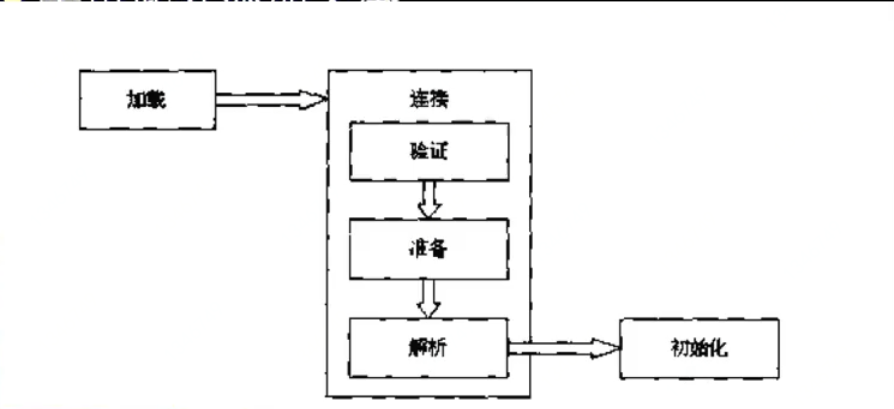

# 类加载
## 类的加载、连接、初始化
#### 在Java代码中，类型的加载、连接、初始化过程都是在程序运行期间完成的
- 类的加载：
  - 把编译好的字节码（**.class文件**）的二进制数据加载到**内存中**，将其放在**运行时数据区的方法区内**，然后创建一个`java.lang.Class`对象，用来封装类在方法区内的数据
  >ps:规范并未说明Class对象位于哪里，HotSpot虚拟机将其放在了方法区中 
  >无论一个类创建了多少个对象，在方法区内都是一个Class对象
  - 加载.class文件的方式
    - 从本地系统中直接加载
    - 通过网络下载.class文件
    - 从Zip、jar等对党文件中加载.Class文件
    - 从数据库中提取.Class文件
    - 将Java源文件动态编译为.Class文件(场景：动态代理、反射)
- 链接：
    - 验证：确保被加载的类的正确性
    - 准备：为类的**静态变量**分配内存，并将其初始化为**默认值**
    - 解析：**把类中的符号引用转换为直接引用**
- 初始化：为类的静态变量赋予初始值

>PS：静态变量在加载的时候，先赋值默认初始值。即int类型赋值0等，然后再赋值代码中的值，
>参考https://www.cnblogs.com/chafanbusi/p/10639757.html

#### Java虚拟机与程序的生命周期
- 在如几种情况，Java虚拟机将结束生命周期
    - 执行了`System.exit()`方法
    - 程序正常执行结束
    - 程序子执行过程中有了异常或错误而异常终止
    - 由于操作系统出现错误而导致Java虚拟机进程终止

#### Java程序对类的使用方式可分为两种
- 主动使用（**7种**）
  - 创建类的实例
  - 访问某个类或接口的静态变量（助记符：`getStatic`），或者对该静态变量赋值（助记符：`putStatic`）
  - 调用类的静态方法（助记符：`invokeStatic`）
  - 反射（如：`Class.forName("com.cui.TestClass")`）
  - 初始化一个类（P）的子类（S），那么也会对（P）主动使用
  - Java虚拟机启动时被标记为启动的类（JUnit test、Main方法）
  - JDK7 开始提供的动态语言支持：`java.lang.invoke.MethodHandle`实例的解析结果（REF_getStatic、REF_putStatic、REF_invokeStatic）句柄对应的类没有初始化则初始化。ps：很少接触到
- 被动使用
  >除了以上7种情况，都看作是被动使用，都不会对类的初始化，但不代表不对类进行加载、连接。 
  代码请参考：ClassLoadTest_1、ClassLoadTest_2

#### 类必须在被Java程序“首次主动使用”时，虚拟机才初始化他们
